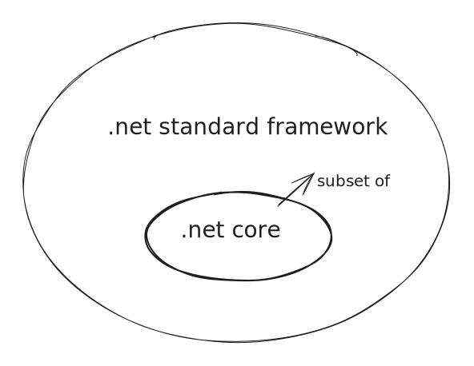
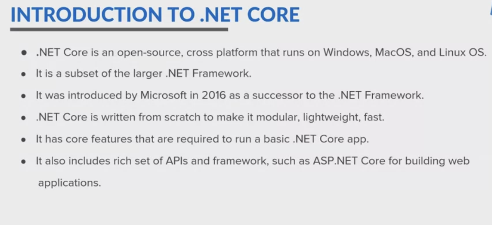

# Introduction to ASP.NET

## Introduction to .Net Core

* NET Core is an open-source cross-platform that runs on Windows, MacOS, and Linux OS.&#x20;
* Basically, it works across different platforms and has been redesigned in a way that makes my.NET application fast, flexible and modern.&#x20;



* Dotnet core was introduced by Microsoft in 2016 as a <mark style="color:purple;">**successor to the.NET framework**</mark><mark style="color:purple;">.</mark>&#x20;
* This happens to be one of the major contribution by Microsoft, as developers can now build Android, iOS, Linux, Mac, and Windows application with.NET Core which is completely open source.
* NET Core is returned from scratch. That is the reason the applications are more modular, lightweight, fast, flexible, and modern.
* It also includes rich set of APIs and frameworks such as ASP.NET core for building large enterprise based web applications.

<figure><figcaption></figcaption></figure>

## Why .Net Core

* .NET Core is cross-platform<mark style="color:purple;">,</mark> which is easier for developers to create applications that can be used on multiple platforms or run your applications regardless of your platform target.&#x20;
* It is currently supporting three main operating systems, <mark style="color:purple;">Windows, Linux, and macOS.</mark>
* .NET Core is <mark style="color:purple;">high in performance.</mark> Because of its performance, the flexible, fast, and modern application can be developed.
* .NET Core is <mark style="color:purple;">cloud-ready</mark>, which is to work well in cloud environment as well.&#x20;
* Modern development of.NET Core provides developers with modern development tools and techniques like supporting for <mark style="color:purple;">asynchronous programming</mark> and it has a high availability to write the lightweight implementation with the well-organized and multi supported editors like VS code. Along with providing the.NET CLI features to use these open COS editors as well.

<figure><figcaption></figcaption></figure>

### Features of .net Core

* NET Core is open-source.&#x20;
* Cross-platform, has a modular architecture to develop the web applications.
* Supports multiple languages and target multiple frameworks.&#x20;
* Consistent gives a high support of CLI tools.
* Flexible deployment.
* Has a compatibility with different OS and programming languages. <mark style="color:orange;">As.NET is a multilingual platform for developing the applications.</mark>

<figure><figcaption></figcaption></figure>

## .NET Core Version History

* Basically, every Microsoft product has a life cycle. The life cycle begins when a product is released and ends when it's no longer supported.&#x20;
* Customers can choose the long term support or standard term support, based upon their choices.&#x20;

<figure><figcaption></figcaption></figure>

* As the first version of .NET Core was **released in June 27, that was 1.0.**&#x20;
* There are two release type&#x73;**,&#x20;**<mark style="color:purple;">**long term support and standard terms support.**</mark>&#x20;
* <mark style="color:orange;">Long term support or LTS releases are supported for three years after the initial release.</mark>&#x20;
* <mark style="color:orange;">Standard term support, which is STS, releases, are supported for six months after a sub sequent STS or LTS release.</mark>&#x20;
* These releases happens every 12 months so that the support period of STS is 18 months.

## Difference Between .NET Framework and .NET Core

|  .NET Core                                                                                                                                     | .NET Framework                                                                                                                                                                                                                          |
| ---------------------------------------------------------------------------------------------------------------------------------------------- | --------------------------------------------------------------------------------------------------------------------------------------------------------------------------------------------------------------------------------------- |
| .NET Core is a general-purpose development platform for developing modern Cloud-based software application on different operating system.      | Certain components of.NET Framework are open-sourced. For Enterprised Edition, all are paid.                                                                                                                                            |
| Works on the principle of build once and run anywhere ,.NET Core is compatible with various operating system as Windows, Linux, and Mac OS     | NET Framework is compatible with the Windows operating system                                                                                                                                                                           |
| Application models does not support desktop applications development in.NET Core. It rather focuses on Web, Windows, Mobile, and Windows Store | <p>NET Framework is used for the development of both desktop and web applications, as well as it supports Windows Forms and WPF applications.<br>If you are more objective to desktop application, you should opt-out.NET Framework</p> |
| NET Core offers high performance and scalability                                                                                               | NET Framework is less effective in comparison to.NET Core in terms of performance and scalability of the application.                                                                                                                   |
| Net Core does not have features like code access security                                                                                      | Code access security feature is present in.NET Framework                                                                                                                                                                                |
| NET Core provide lightweight editors and command line tools for all supported platforms                                                        | .NET Framework is heavy for command line interface. Developers prefer to work on the lightweight command line interface. That's what they opt out.NET Core                                                                              |

<figure><figcaption></figcaption></figure>

## Setting up a development environment

Dotnet code <mark style="color:purple;">provides a CLI environment.</mark> With the help of command line, we can check whether the dotnet is installed or not.

```markup
// To check dotnet is installed or not

dotnet

// To check dotnet version

dotnet --version

// All Dotnet CLI Commands

dotnet new list

// To create a basic console application

dotnet new console- <name of the app>

// To open project / directory in VS Code

cd <name of the app> code . // this will open the current dictory in vs code.

// To Build the project

dotnet build // in VS Code Terminal

// To Run the project

dotnet run
```

The moment I'll write this build command, the current project folder, which is opening my VS code gets built and the <mark style="color:yellow;">**bin folder gets generated with the build properties with the DLL EXE and the JSON files.**</mark>

When you create a new project using Rider / Visual Studio you can see wheather it is .Net Core application or .Net Framework application.


## Documentation Links

.NET fully supports C# and F# (and C++/CLI as of 3.1; only enabled on Windows) and supports Visual Basic .NET


**NET Core and its features**



**NET Core Version History**



**Difference Between .NET Framework and .NET Core**



**Setting up a development environment**

