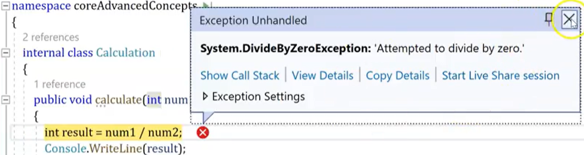

# Exception Handling

<figure><figcaption></figcaption></figure>

* Exceptions are nothing, but they are known as runtime errors as well. The errors which are occurred at the time of program execution are called runtime errors, and we also call it as exceptions.&#x20;
* These errors are good at runtime due to various reasons such as when we entered the wrong data into a variable, trying to open a file for which there is no permission, or trying to connect to the database with the wrong credentials, and so on.&#x20;
* They basically abnormally terminates the flow of the program instructions that call we know as them exceptions.
* &#x20;In such a case, we create an exception object that handles the exception with the exception handling mechanism in which various or couple of exception blocks are introduced. This entire process is known as exception handling.

#### To handle runtime errors or exceptions, we have these handlers and keywords.

<figure><figcaption></figcaption></figure>

1. **Try block.** This block is used to define the try block, and rewrite the piece of code in this block where the chances of getting exceptions are high. If any exception occurs, it throws an exception to the catch block, and catch resolves that exception.&#x20;
2. **Catch block** is an exception handler block where you can perform some actions such as logging and auditing the exception. It also takes a parameter of the exception class that which type of exception is being raised and handled.&#x20;
3. **Finally block** will always be executed whether an exception gets occur or not. Usually a finally block should be used to release the resources such as close any streams or file objects that were opened in the try block. Any cleanup code if you would like to write down that you use finally block.&#x20;
4. **Throw** is the keyword which helps you to manually throw the exception, not depending upon the specific circumstances for abnormal termination of a program, but we really wanted to initiate the exception on the basis of conditions. Throw is a keyword which helps in throwing the custom exceptions as per the requirement.

### Try-Catch

<figure><figcaption></figcaption></figure>

This is what we write in the try block, the code that may raise an exception. If an exception is raised, the drive will be followed by the catch.&#x20;

It it will handle the exception depends what do you want to handle here? You would like to log the exception. You would like to print the exception to the end-user and what not. Here we place the code that might generate an exception inside the try block. The try block will throw the exception to the catch block.

### Try-Catch-Finally

<figure><figcaption></figcaption></figure>

This is along with the finally, <mark style="background-color:purple;">Finally is the blog that will always get executed</mark> <mark style="background-color:purple;">where there is an exception or not.</mark> If even though in any case you are not writing the Catcher, in any case you're catches not capable of handling the exception. finally is the blog that will always execute. Thus, all the cleanup code needs to be returned in the finally block.

<figure><figcaption></figcaption></figure>

## Exception Handling in C\#

This abnormal termination is called a runtime error and exception.

<figure><figcaption><p>Abnormal termination</p></figcaption></figure>

```csharp
        public void ExHandling(int num1, int num2)
        {
            try
            {
                var c = num1 / num2; // This will cause a DivideByZeroException
            }
            catch (DivideByZeroException ex)
            {
                Console.WriteLine("Error: Division by zero is not allowed.");
                Console.WriteLine(ex.Message);
            }
            catch (Exception ex) // Should always be last catch
            {
                Console.WriteLine("An error occurred: " + ex.Message);
            }
            finally
            {
                Console.WriteLine("This block always executes.");
            }
        }
```

We can see that exception block is executing. There is an exception because you are passing zero exception pass to the catch block. Catch block is printing the exception messages. Finally will always execute once again. This is how the iteration works with the exception handling with a try-catch and finally block.

<details>

<summary><kbd><em><mark style="color:yellow;">The Generic Exception (</mark></em><em><mark style="color:yellow;"><code>Exception</code></mark></em><em><code> </code></em><em><code>ex</code></em><em><mark style="color:yellow;">) block should always be at last catch block.</mark></em></kbd></summary>

_Because if this would be the first exception block, this can handle all the types of exception, there is no point of having the multiple catch blocks._

</details>

_This is how multi-catch blocks works with one try and one finally_
