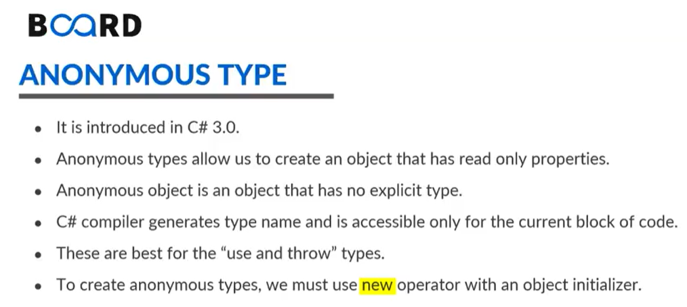
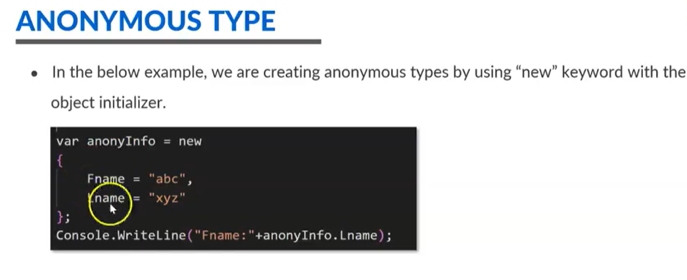

# Anonymous Type

<figure><figcaption></figcaption></figure>

* Anonymous Types are the data types in C# that holds <mark style="color:yellow;">public read-only attributes.</mark>
* &#x20;Anonymous types is an object that has no explicit types, so it can store **any kind of value**. _<mark style="color:yellow;">For example, a variable, object, or a collection.</mark>_&#x20;
* Anonymous type does not contain functions, constructors, getter, setter methods, and so on, which sets them apart from regular classes.&#x20;
* C# compiler generates type name and is accessible for only the current block of code. That is the reason we also call this type as <mark style="color:yellow;">use and throw</mark> type.&#x20;
* To create anonymous type, we use <mark style="color:yellow;">new</mark> keyword. It can be seen that the declaration is very similar to how we declare objects with the help of the new keyword.

<figure><figcaption></figcaption></figure>

* In above image the is how anonymous type is declared inside the **curly** braces. We need an attribute name followed by the value to store in it into the anonymous type object and then we can access with the help of the <mark style="color:yellow;">dot</mark> operator.
* Nested anonymous can also access this with the help of <mark style="color:yellow;">dot</mark> operator,\
